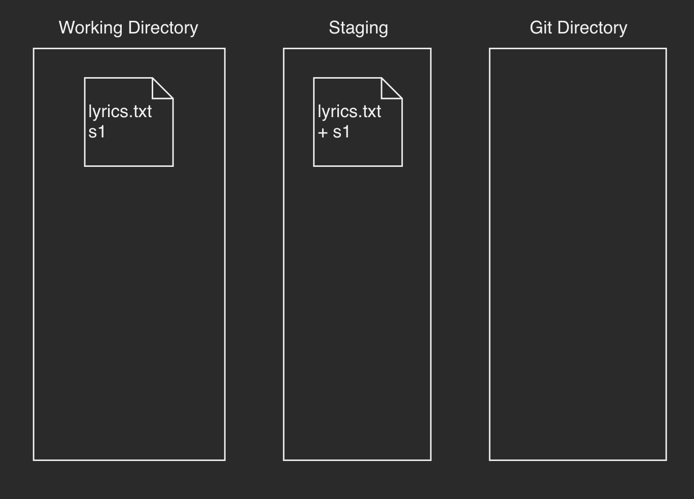
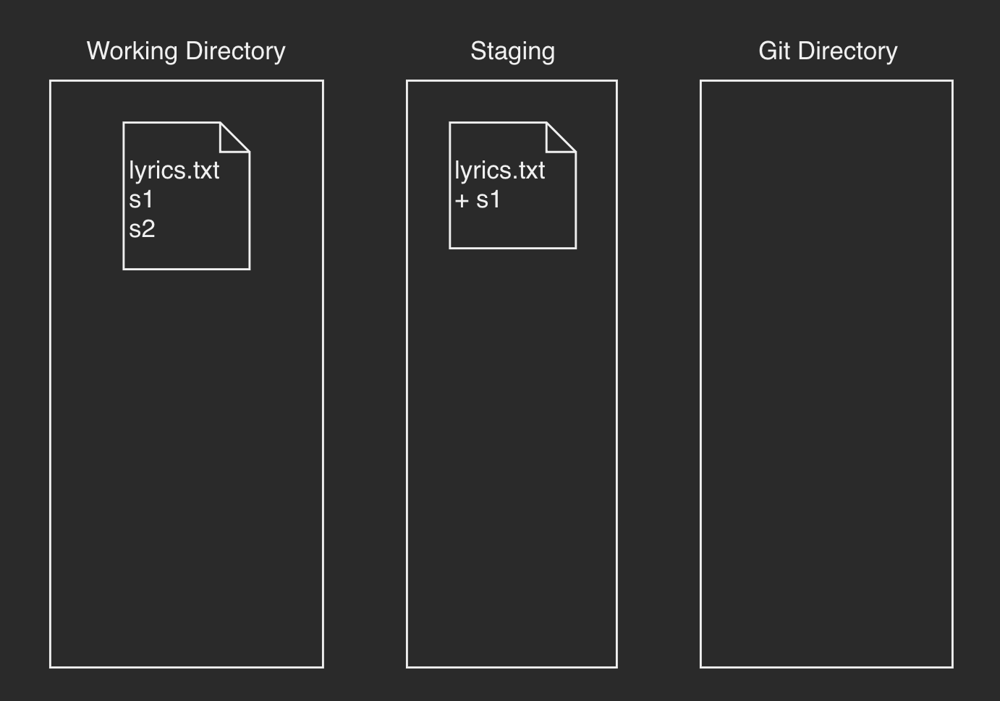
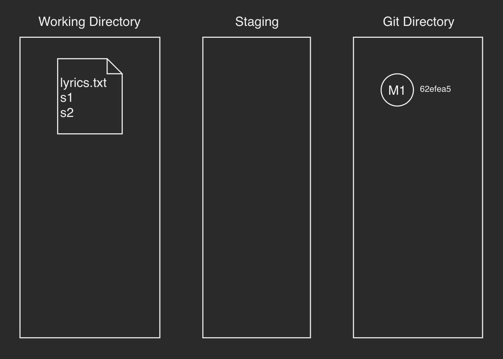
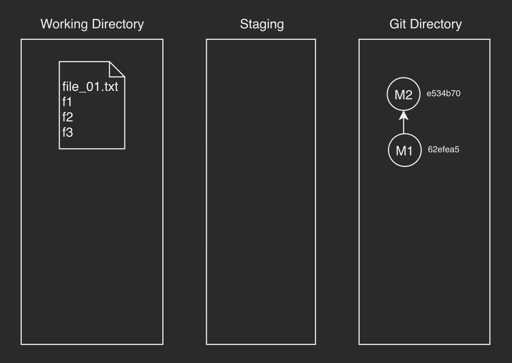
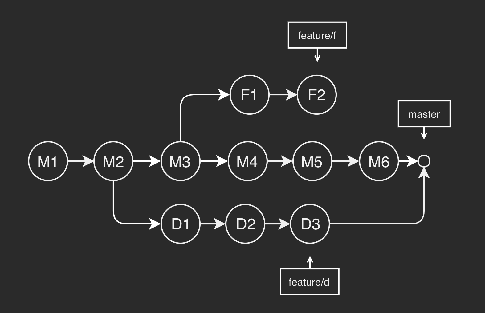
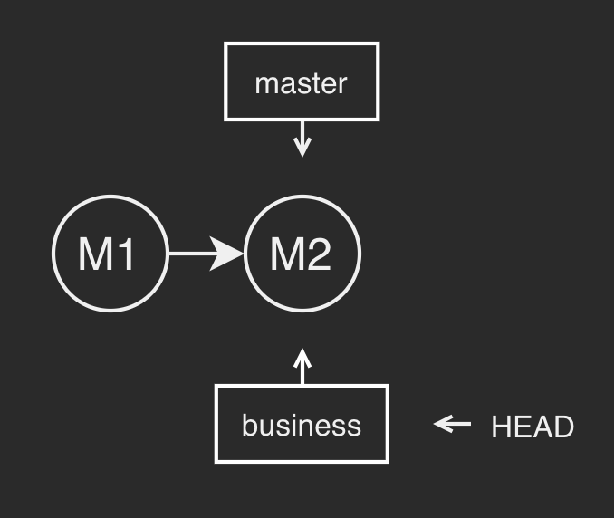
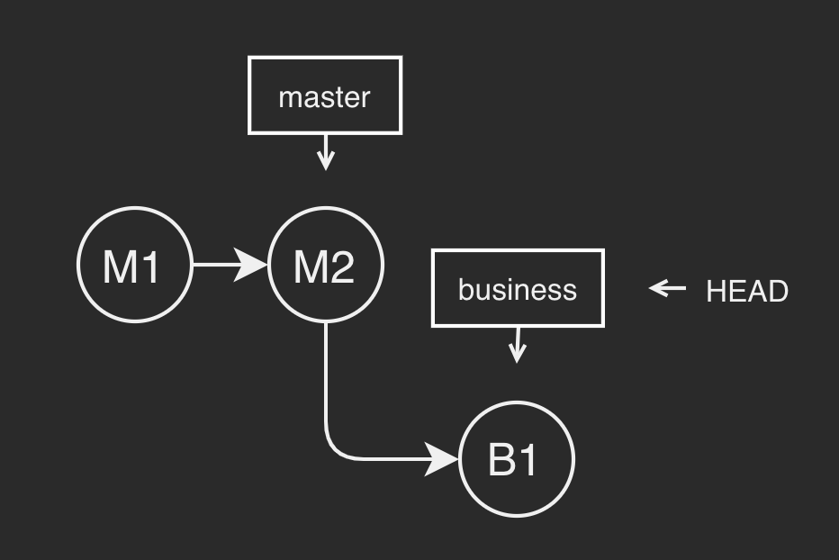
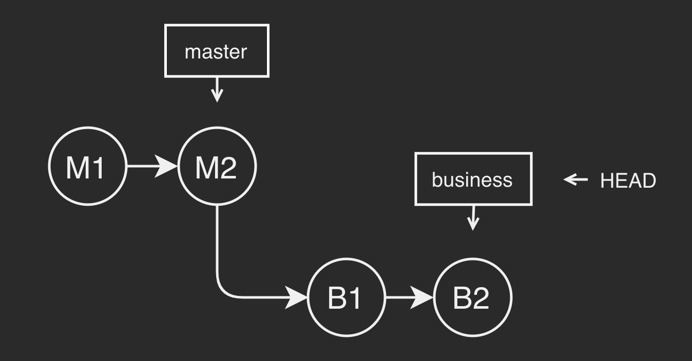
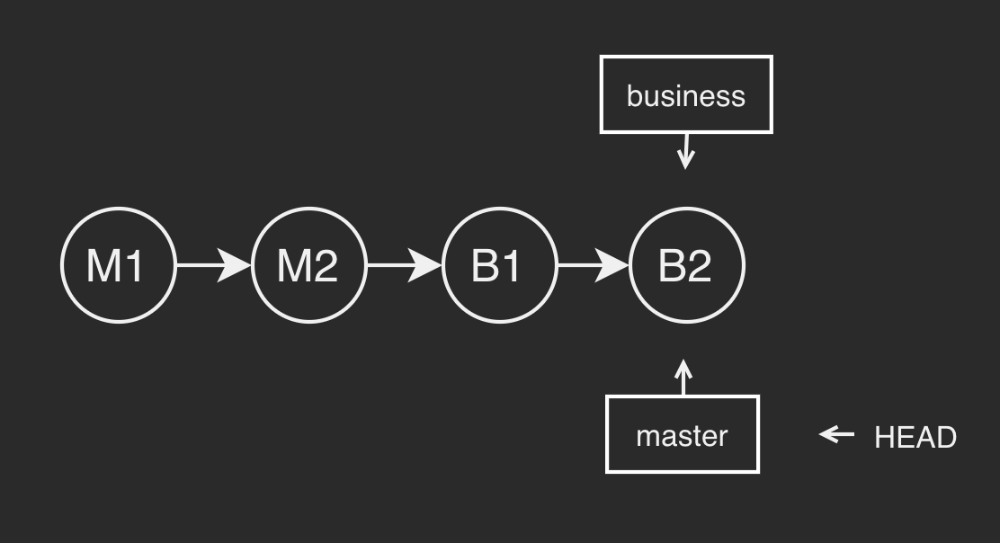
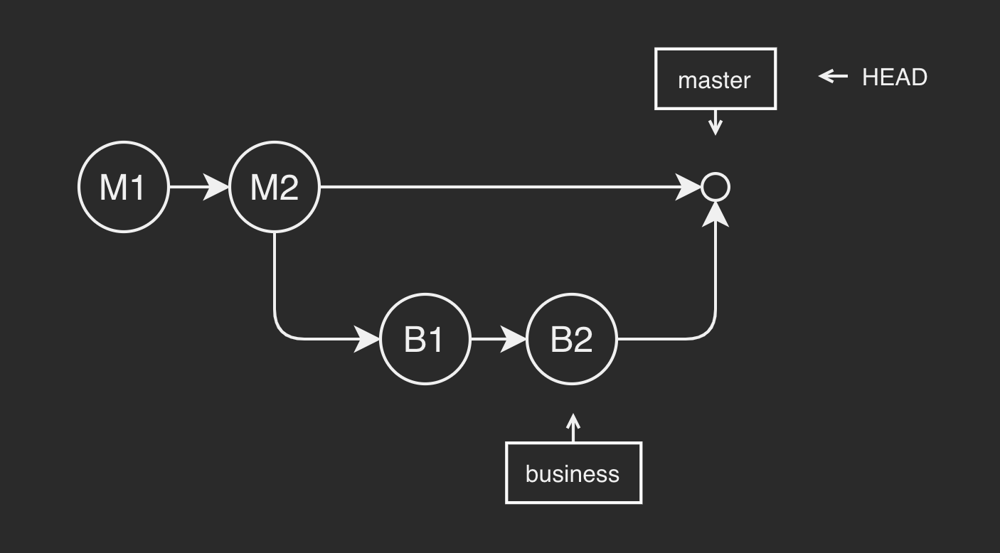

# NTUOSS Git Workshop

*by [Clarence Castillo](https://github.com/clarencecastillo) for [NTU Open Source Society](https://github.com/ntuoss)*

This workshop features a hands-on approach to learning the basics of [Git](https://git-scm.com/). Familiarity with how to use your computer's terminal or command prompt would be useful but not required to complete this workshop.

**Disclaimer:** *This document is only meant to serve as a reference for the attendees of the workshop. For a full, comprehensive documentation of Git, please check the official [reference manual](https://git-scm.com/doc).*

---

### Workshop Details
**When**: Friday, 19 October 2018. 6:30 PM - 8:30 PM.</br>
**Where**: LT1 Nanyang Technological University</br>
**Who**: NTU Open Source Society

### Questions
Please raise your hand any time during the workshop or email your questions to [me](mailto:hello@clarencecastillo.me) later.

### Errors
For errors, typos or suggestions, please do not hesitate to [post an issue](https://github.com/clarencecastillo/NTUOSS-GitWorkshop/issues/new)! Pull requests are very welcome, thank you!

___

## Introduction

This workshop is primarily about getting yourselves started with Git. We will begin by covering some background on version control systems, then move on to how to get it running on your system and then finally cover some of the basic commands you'll be using almost 80% of the time when working with Git.

Unlike most of our workshops, we'll actually walk you through the installation and setup phase since it's pretty much integral to the rest of the workshop's content.

### Version Control Systems


Version control is a system that keeps track of changes to a set of files over time such that you are able traverse and access certain versions of it later. It's often used to maintain versions of software source code but in reality it can be used with any type of file on a computer as well.

### Git

There are many things that can describe what Git is but one thing I need to point out is that `Git != GitHub`. Git is a Version Control System while GitHub is a hosting service for Git repositories. Essentially, Git is the tool and GitHub is one of the services available out there to host projects that use Git.

Essentially, Git is a distributed version control system aimed at speed, data integrity and support for distributed, non-linear workflows. It is a mature, actively maintained open source project developed in 2005 by Linus Torvalds, the famous creator of the Linux OS kernel. 

### VCS Before Git


To fully understand and appreciate Git, we have to first remember what developers were using before it and get an insight as to why it was replaced. Git superseded Subversion by rethinking one of its core designs - centralised revision control. This resulted in a system where branching was highly discouraged because of how difficult it was to do merging and how forking was more or less nonexistent due to its centrality.

Thanks to Git's distributed architecture, branching became trivial, merging manageable and forking a feature. Rather than have only a single place for the full version history, every working copy is now a repository that can contain the full history of all changes.

## Installation and Setup

Now that we've discussed what Git is and why we should be using it, let's dive into the actual usage of Git.

#### Download and install the latest version of Git.

For Mac OS X, you may already have it if you've installed XCode before (verify your installation as shown below). If not, the easiest way to install it would be using the [Git for Mac Installer](https://git-scm.com/download/mac).

For Windows, use the latest stand-alone [Git for Windows Installer](https://github.com/git-for-windows/git/releases) and follow the default configuration as shown in the wizard screen.

To verify your installation, open a terminal or command prompt and execute:  

```bash
$ git --version
git version 2.19.1
```

#### Configure Git Identity

For accountability, Git needs your identity to associate with any commits that you create. To configure this, execute the following commands replacing the placeholders with your actual information:

```bash
$ git config --global user.name "Firstname Lastname"
$ git config --global user.email "useremail@email.com"
```

## Git Fundamentals

For the purposes of this workshop, we'll rewrite the iconic song [I'll Make a Man Out of You](https://www.stlyrics.com/lyrics/mulan/illmakeamanoutofyou.htm) utilising Git to illustrate how easily it can be used to improve your workflow.

For now, let's start fresh by initialising a local directory. To do that, you'll need to use the `git init <directory>` command. This command is a one-time directive you use only during the initial setup of a new repo. Initialise a git repository named `be-a-man` and `cd` into that automatically created folder.

```bash
$ cd /path/to/workspaces
$ git init be-a-man
Initialized empty Git repository in /path/to/workspaces/be-a-man/.git/
$ cd be-a-man
```

For now, take note of the path which you created this repository. We'll come back to it once we've covered some required fundamentals about Git.

### Git Repositories

A Git repository is a virtual storage of your project. Kinda like a directory accompanied by a ledger that keeps track of all changes done to its contents.

These repositories are usually obtained in one of the two ways. We can either

1. Initialise a local directory as a Git repository, or
2. *Clone* an existing repository hosted elsewhere.

What we just did earlier was to initialise a local directory as a Git repository using `git init`. Notice that Git automatically creates the directory if you supply it the name of the folder as an argument, otherwise it will initialise the exact directory where the command was executed.

### The Three "Trees"

There are three main sections which Git maintains to keep track of the repository's internal state: the Working Directory, the Staging Area and the Git Directory.


> **Working Directory**  
> Holds the actual files. Reflected as is by the local OS's file system. Represents the immediate changes made to content inside the repository. Files are further classified as either *tracked* or *untracked* (more on this in awhile).

> **Staging Area**  
> Think of this area as the buffer between the Working Directory and the Git Directory. Changes to the Working Directory are promoted to the Staging Area to be bundled together for the next commit.

> **Git Directory (Repository)**  
> Being the most important section, this is where Git stores the history of committed changes done to your project. This is also the only section of your repository that gets propagated to other remote repositories.


## Basic Git Workflow

The basic git workflow goes something like this:

1. Add/modify files inside the working directory. This is usually done outside using an IDE.
2. Selectively stage changes that are to be part of the next commit. These can be in the form of entire files or simply chunked lines of code changed within a file.
3. Commit the staged stuff to the git directory. This stores a permanent snapshot of the tracked files into the commit history.

### Checking Repository Status

To determine which files are in which state, use the `git status` command. Running this command immediately after `git init` should give the following output.

```bash
$ git status
On branch master

No commits yet

nothing to commit (create/copy files and use "git add" to track)
```

The output above tells us that none of the tracked files are modified. This is expected because we initialised this repo from an empty directory, hence there shouldn't be any tracked or untracked files to begin with.

The command also tells us which *branch* we're currently on. By default, this branch is always `master` but we can easily change this to a different branch.  More on branching at the later part of the workshop.

### Modifying Files Inside The Working Directory

Open your favourite text editor and create a new text file named `lyrics.txt`. Let's begin by writing the song's first stanza. This represents a segment of your source code you've written which you'd like to be comitted to the repository.

```
Let's get down to business
To defeat the Huns
Did they send me daughters
When I asked for sons?
```

To see our change, run `git status` again with the new file. You'll see that it is untracked because Git sees a file you didn’t have before. 

```bash
$ git status
On branch master

No commits yet

Untracked files:
  (use "git add <file>..." to include in what will be committed)

	lyrics.txt

nothing added to commit but untracked files present (use "git add" to track)
```

### Tracking New Files

To track the new file, use the `git add` command. Running `git status` again right after it should indicate that `lyrics.txt` is now tracked and ready for a commit.

```bash
$ git add lyrics.txt
$ git status
On branch master

No commits yet

Changes to be committed:
  (use "git rm --cached <file>..." to unstage)

	new file:   lyrics.txt
```



#### Modifying Staged Files

To illustrate how staging really works, let's take it up a notch by modifying our file even after staging it. Open `lyrics.txt` and add the song's next stanza right below the first one. Your file should now look like this:

```
Let's get down to business
To defeat the Huns
Did they send me daughters
When I asked for sons?

You're the saddest bunch I ever met
But you can bet before we're through
Mister, I'll make a man
Out of you
```

Note that the above modification does not in anyway affect what's already staged because Git stages a file exactly as it is when the `git add` command was executed. If you commit now, `lyrics.txt` will be as it was when we staged it and this is how it will go into the commit, not the version of the file as it looks in your working directory which includes the second stanza.

To verify, check your repository's status again and you'll notice that it detected a modification to our file. You'll see that `lyrics.txt` is now written as both staged and not staged. The staged entry refers to the version of the file when we tracked it for the first time using `git add` and the unstaged version refers to the tracked version of the file including our modification.

```bash
$ git status
On branch master

No commits yet

Changes to be committed:
  (use "git rm --cached <file>..." to unstage)

	new file:   lyrics.txt

Changes not staged for commit:
  (use "git add <file>..." to update what will be committed)
  (use "git checkout -- <file>..." to discard changes in working directory)

	modified:   lyrics.txt
```



If you think `git status` is too vague for you and if you want to see the per-line diffrence between what's in your working directory and what's in your staging area, use `git diff`. This command will show you which lines you've changed but not yet staged.

```
$ git diff
diff --git a/lyrics.txt b/lyrics.txt
index 1783c2d..cc65c09 100644
--- a/lyrics.txt
+++ b/lyrics.txt
@@ -1,4 +1,9 @@
 Let's get down to business
 To defeat the Huns
 Did they send me daughters
-When I asked for sons?
\ No newline at end of file
+When I asked for sons?
+
+You're the saddest bunch I ever met
+But you can bet before we're through
+Mister, I'll make a man
+Out of you
\ No newline at end of file
```

Suppose we need both stanzas to be included in our first commit. We need to run `git add` again to stage the latest version of the file. Notice that Git squashes your modifications together such that there is no distinction between the two changes. It would appear as if you wrote both stanzas together which is expected because the file hasn't been committed yet.

```bash
$ git add lyrics.txt
$ git status
On branch master

No commits yet

Changes to be committed:
  (use "git rm --cached <file>..." to unstage)

	new file:   lyrics.txt
```

#### Comitting Staged Files

Now that we're at the final stage of the workflow, commit the changes using `git commit`. For traceability, Git requires every commit to be accompanied by a message which summarises the change done. The easiest way to provide this is to utilise the `-m` flag like this:

```bash
$ git commit -m "Implement first and second stanzas"
[master (root-commit) d6c19b1] Implement first and second stanzas
 1 file changed, 9 insertions(+)
 create mode 100644 lyrics.txt
```

Executing `git status` again tells us that there is nothing in our staging area and that our working directory is clean. Clean just means that our working directory is at par with the latest snapshot (commit) of our git directory.

```bash
$ git status
On branch master
nothing to commit, working tree clean
```



#### Viewing Staged and Unstaged Changes

For this section, we'll be discussing how to view the stuff that's already inside your staging area. This comes really handy especially because it tells you what's going to be part of your next commit.

Edit and stage `lyrics.txt` one more time to implement the chrous. Our file should now look something like this after this step.

```
Let's get down to business
To defeat the Huns
Did they send me daughters
When I asked for sons?

You're the saddest bunch I ever met
But you can bet before we're through
Mister, I'll make a man
Out of you

Be a man
We must be swift as the coursing river
Be a man
With all the force of a great typhoon
Be a man
With all the strength of a raging fire
Mysterious as the dark side of the moon
```

To review the content of our staging area, use `git diff` again but with the `--staged` flag. This command compares your staging area to the last commit.

```
$ git diff --staged
diff --git a/lyrics.txt b/lyrics.txt
index cc65c09..e2b5721 100644
--- a/lyrics.txt
+++ b/lyrics.txt
@@ -6,4 +6,12 @@ When I asked for sons?
 You're the saddest bunch I ever met
 But you can bet before we're through
 Mister, I'll make a man
-Out of you
\ No newline at end of file
+Out of you
+
+Be a man
+We must be swift as the coursing river
+Be a man
+With all the force of a great typhoon
+Be a man
+With all the strength of a raging fire
+Mysterious as the dark side of the moon
\ No newline at end of file
```

You may be surprised that the output aboves tells us that we've also modified the line `Out of you` although all we did was just insert the new chorus after it. It's not be obvious at first but the reason why `Out of you` is detected as modified is because we've added an invisible newline character `\n` after it so that we can insert the next stanza.

Commit the staged entries using `git commit` and make sure to provide a commit message using the `-m` flag.

```bash
$ git commit -m "Implement chorus"
[master acc59ac] Implement chorus
 1 file changed, 9 insertions(+), 1 deletion(-)
```



#### Viewing Commit History

After having created several commits, you’ll probably want to look back to see what has happened. To do this, Git provides the `git log` command which shows the commit logs.

```bash
$ git log
commit acc59acfcddddd645049f28e746d2bba3e55f69b (HEAD -> master)
Author: Clarence Castillo <clarencecastillo@outlook.com>
Date:   Sun Oct 14 14:30:34 2018 +0800

    Implement chorus

commit d6c19b133c0cac1a366fb88603b1790b8369e405
Author: Clarence Castillo <clarencecastillo@outlook.com>
Date:   Sun Oct 14 14:27:51 2018 +0800

    Implement first and second stanzas
```

By default, Git lists the commits made in a repository in reverse chronological order, with the most recent ones up on the top. Each commit is accompanied with its SHA-1 checksum, the name and email of the author, the date written and the commit message.

### Good Commit Messages

There isn't a strict do-or-die rule out there that tells you how exactly you should be writing your commit messages but there are some agreed upon guidelines which attempt to standardise this practice. 

For starters, here's a list of tips you may want to keep in mind when writing commit messages:

1. Limit your commit message to 50 characters
2. Capitalise the message
3. Do not end the message with a punctuation
4. Use the imperative stance
5. Avoid uninformative, look-elsewhere messages

One trick that I always use when writing a commit message is to try come up with a statement which completes the phrase `If applied, this commit will ...`. This method forces you to write in the imperative stance and encourages you to give a descriptive phrase about the commit.

In addition, the commit message is conventionally split into the message title and message body using a blank line. Though used in practice, this is actually not required especially if the subject title is more than sufficient to describe the change.

Different teams practice different strategies but what's important is that having a good guideline for creating commits and sticking to it makes working with Git and collaborating with other developers a lot easier.

### Branching

Branching is a mechanism where you diverge from the main line of development (commit history) and do work on it independent of the main line. Most VCS tools do have this feature but it is somewhat an expensive process, often requiring the entire source code to be copied physically which can take a long time for not-so-small projects.



Essentially, commits in Git are just objects that contain a pointer to the *snapshot*, some metadata, and pointers to the commit which came before it. 

Git makes branching incredibly lightweight because branches in Git are simply small movable pointers that point to one of the commits. As you make more commits in a branch, the branch pointer moves forward automatically.

When you initialise a new repository and create your first commit, a new branch called `master` is created by default. This branch is just like any other branch and the only reason why you'll see most repositories have it is because it's the default name and most developers just can't be bothered to change it.

#### Creating Branches

To create a new branch, use the command `git branch <name>`. By default, this creates a new pointer to the same commit you're currently on, but you can easily change this by providing the SHA-1 checksum of the commit you'd like to branch out of.

Git uses a special pointer called `HEAD` to determine which branch you're currently on. When you create a new branch, Git does not automatically move `HEAD` into that new branch. To switch to different one, run the command `git checkout <branch>`.

To illustrate how branches work, let's write a different version of the song on a different branch so we can easily switch back to the original version later. Name the branch as `business` and don't forget to checkout.

```bash
$ git branch business
$ git checkout business
Switched to branch 'business'
```



#### Working With Branches

Open your text editor again and modify only the first stanza as follows. Be sure to leave the other stanza and the chorus untouched.

```
Let's get down to business
To outbid the Huns
Here I have some figures
And some facts and sums!
```

Changing the song lyrics correctly as instructed above should give you the following results when running `git diff`.

```
$ git diff
diff --git a/lyrics.txt b/lyrics.txt
index e2b5721..1529e97 100644
--- a/lyrics.txt
+++ b/lyrics.txt
@@ -1,7 +1,7 @@
 Let's get down to business
-To defeat the Huns
-Did they send me daughters
-When I asked for sons?
+To outbid the Huns
+Here I have some figures
+And some facts and sums!

 You're the saddest bunch I ever met
 But you can bet before we're through
```

Now that we're happy with the change, let's stage and commit it. Since we're on a different branch, we can safely do this without worrying about the original version of the song.

```bash
$ git add *
$ git commit -m "Edit first stanza"
[business d6a9526] Edit first stanza
 1 file changed, 3 insertions(+), 3 deletions(-)
$ git log
commit d6a9526373b1fd0476f13dd176b05d878877e199 (HEAD -> business)
Author: Clarence Castillo <clarencecastillo@outlook.com>
Date:   Sun Oct 14 14:49:14 2018 +0800

    Edit first stanza

commit acc59acfcddddd645049f28e746d2bba3e55f69b (master)
Author: Clarence Castillo <clarencecastillo@outlook.com>
Date:   Sun Oct 14 14:30:34 2018 +0800

    Implement chorus

commit d6c19b133c0cac1a366fb88603b1790b8369e405
Author: Clarence Castillo <clarencecastillo@outlook.com>
Date:   Sun Oct 14 14:27:51 2018 +0800

    Implement first and second stanzas
```

Notice that `git log` output also tells us where the branches are currently pointing to. Since `HEAD` is pointing to `business` when we created the commit, it automatically forwarded the branch along with it while keeping the other branch `master` untouched.



Let's add one more commit to this branch by modifying the second stanza and the chorus together. The file should look like this now.

```
Let's get down to business
To outbid the Huns
Here I have some figures
And some facts and sums!

It's the saddest lot you've ever bought
But if you bet on this one too
Mister, I'll make you a buck
Or two

Business man
We must be swift as the stock exchanges
Business man
With all the force of a great tycoon
Business man
With all the strength of a thriving market
Mysterious as my company's revenues
```

Like before, stage and commit the changes done to the song.

```bash
$ git add *
$ git commit -m "Edit second stanza and chorus"
[business 30e6abb] Edit second stanza and chorus
 1 file changed, 11 insertions(+), 11 deletions(-)
```



#### Merging Branches

Suppose we've decided that our work with the modification of the song is complete and ready to be merged back into the main branch. To do this, switch to the target branch `master` and run the command `git merge <branch>`.

Note that in a merge, there's always a source branch a target branch. The distinction between the two determines which moves forward in the tree. In our case, we can either merge `master` into `business` or merge `business` into `master`.

Since `master` is pointing to a commit which `business` branched out of, we can call the former type of merge a `fast-forward` merge because all we have to do is make the pointer traverse along the commit path all the way to where `business` is currently located.



As for the latter type of merge, it can be viewed as squashing all the changes in the `business` branch as one big change and applying that to the `master` branch, creating a new commit in the process.



There's no one right way of doing this but what's important is that you know the difference between the two. Personally, I'd prefer the second approach because it explicitly writes to the commit history that we've merged `business` into `master`, unlike the first approach which silently moves the pointer into another commit.

For this section, let's merge `business` into `master` using the following commands.
```
$ git checkout master
```

### Wokring Collaboratively
- Remote Repositories
- Forking
- Pushing Changes
- Pull Requests

### Git GUI Client

1. Download and install the latest version of [GitKraken](https://www.gitkraken.com/). As with most things in life, you're free to use any GUI Git client but we'll be using this one in particular for the workshop so you're on your own if you're using anything else.
