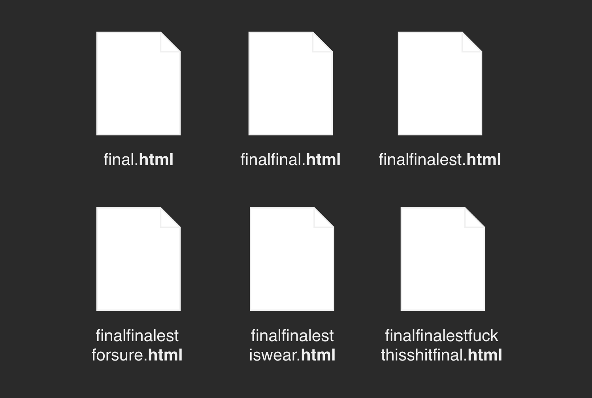
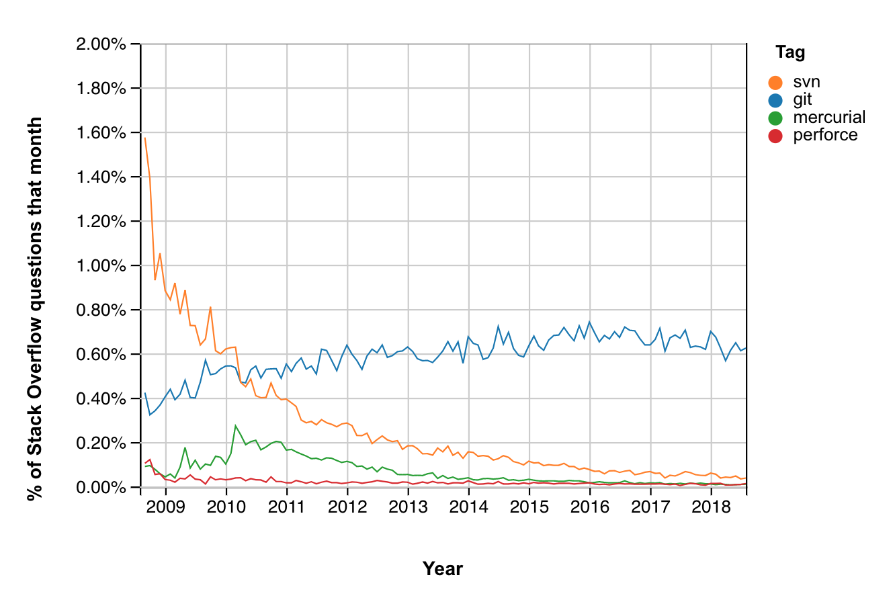
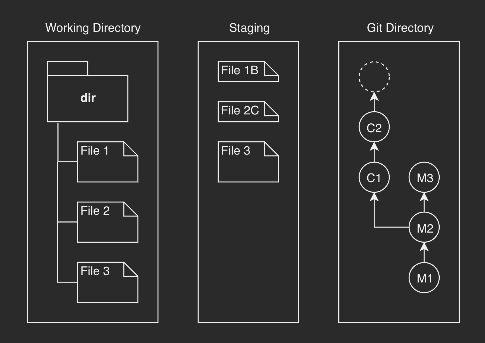
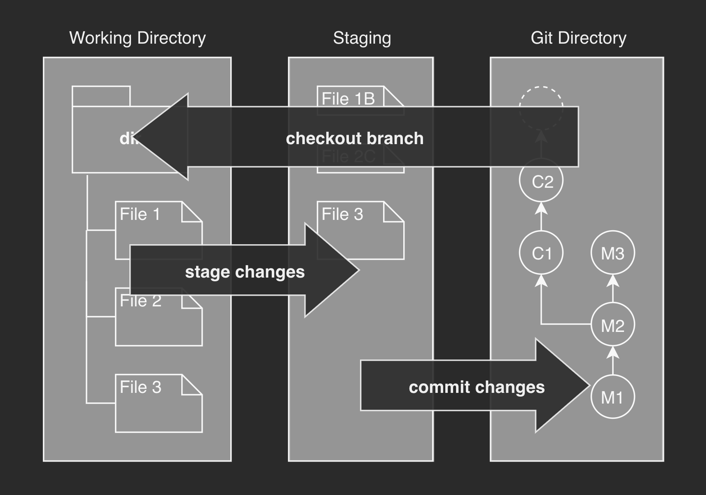

# NTUOSS Git Workshop

*by [Clarence Castillo](https://github.com/clarencecastillo) for [NTU Open Source Society](https://github.com/ntuoss)*

This workshop features a hands-on approach to learning the basics of [Git](https://git-scm.com/). Familiarity with how to use your computer's terminal or command prompt would be useful but not required to complete this workshop.

**Disclaimer:** *This document is only meant to serve as a reference for the attendees of the workshop. For a full, comprehensive documentation of Git, please check the official [reference manual](https://git-scm.com/doc).*

---

### Workshop Details
**When**: Friday, 19 October 2018. 6:30 PM - 8:30 PM.</br>
**Where**: LT1 Nanyang Technological University</br>
**Who**: NTU Open Source Society

### Questions
Please raise your hand any time during the workshop or email your questions to [me](mailto:hello@clarencecastillo.me) later.

### Errors
For errors, typos or suggestions, please do not hesitate to [post an issue](https://github.com/clarencecastillo/NTUOSS-GitWorkshop/issues/new)! Pull requests are very welcome, thank you!

___

## Introduction

This workshop is primarily about getting yourselves started with Git. We will begin by covering some background on version control systems, then move on to how to get it running on your system and then finally cover some of the basic commands you'll be using almost 80% of the time when working with Git.

Unlike most of our workshops, we'll actually walk you through the installation and setup phase since it's pretty much integral to the rest of the workshop's content.

### Version Control Systems



Version control is a system that keeps track of changes to a set of files over time such that you are able traverse and access certain versions of it later. It's often used to maintain versions of software source code but in reality it can be used with any type of file on a computer as well.

### Git

There are many things that describe what Git is but one thing I need to point out is that `Git != GitHub`. Git is a Version Control System while GitHub is a hosting service for Git repositories. Essentially, Git is the tool and GitHub is one of the services available out there to host projects that use Git.

In a nutshell, Git is a mature, actively maintained open source project developed in 2005 by Linus Torvalds, the famous creator of the Linux OS kernel. 

### Life Before Git



To fully understand and appreciate Git, we have to first remember what developers were using before it and get an insight as to why it was replaced. Git superseded Subversion by rethinking one of its core designs - centralised revision control. This resulted in a system where branching was highly discouraged because of how difficult it was to do merging and how forking was more or less nonexistent due to its centrality.

Thanks to Git's distributed architecture, branching became trivial, merging manageable and forking a feature. Rather than have only a single place for the full version history, every working copy is now a repository that can contain the full history of all changes.

## Installation and Setup

Now that we've discussed what Git is and why we should be using it, let's dive into the actual usage of Git.

#### Download and install the latest version of Git.

For Mac OS X, you may already have it if you've installed XCode before (verify your installation as shown below). If not, the easiest way to install it would be using the [Git for Mac Installer](https://git-scm.com/download/mac).

For Windows, use the latest stand-alone [Git for Windows Installer](https://github.com/git-for-windows/git/releases) and follow the default configuration as shown in the wizard screen.

To verify your installation, open a terminal or command prompt and execute:  

```bash
$ git --version
git version 2.19.1
```

#### Configure Git Identity

For accountability, Git needs your identity to associate with any commits that you create. To configure this, execute the following commands replacing the placeholders with your actual information:

```bash
$ git config --global user.name "Firstname Lastname"
$ git config --global user.email "useremail@email.com"
```

## Git Fundamentals

### Git Repositories

A Git repository is a virtual storage of your project. Kinda like a directory accompanied by a ledger that keeps track of all changes done to its contents.

These repositories are typically obtained in one of the two ways:

1. Initialise a local directory as a Git repository, or
2. *Clone* an existing repository hosted elsewhere.

For this section of the workshop, we'll start fresh by initialising a local directory. To do that, you'll need to use the `git init` command. This command is a one-time directive you use only during the initial setup of a new repo.

```bash
$ cd /path/to/workspaces
$ git init git-workshop
Initialized empty Git repository in /path/to/workspaces/git-workshop/.git/
```

For now, take note of the path which you created this repository. We'll come back to it once we've covered some required fundamentals about Git.

### The Three "Trees"

There are three main sections which Git maintains to keep track of the repository's internal state: the Working Directory, the Staging Area and the Git Directory.



> **Working Directory**  
> Holds the actual files. Reflected as is by the local OS's file system. Represents the immediate changes made to content inside the repository. Files are further classified as either *tracked* or *untracked* (more on this in awhile).

> **Staging Area**  
> Think of this area as the buffer between the Working Directory and the Git Directory. Changes to the Working Directory are promoted to the Staging Area to be bundled together for the next commit.

> **Git Directory (Repository)**  
> Being the most important section, this is where Git stores the history of committed changes done to your project. This is also the only section of your repository that gets propagated to other remote repositories.



#### Checking Repository Status

To determine which files are in which state, use the `git status` command. Running this command immediately after `git init` should give the following output.

```bash
$ git status
On branch master

No commits yet

nothing to commit (create/copy files and use "git add" to track)
```

The output above tells us that none of the tracked files are modified. This is expected because we initialised this repo from an empty directory, hence there shouldn't be any tracked or untracked files to begin with.

The command also tells us which *branch* we're currently on. By default, this branch is always `master` but we can easily change this to a different branch.  More on branching at the later part of the workshop.

### Basic Git Workflow

The basic git workflow goes something like this:

1. Add/modify files inside the working directory. This is usually done outside using an IDE.
2. Selectively stage changes that are to be part of the next commit. These can be in the form of entire files or simply chunks of lines of code changed within a file.
3. Commit the staged stuff to the git directory. This stores a permanent snapshot of the tracked files into the commit history.

Open your favourite text editor and create a new text file named `file_01.txt`. In the first line, type `f1`. Although trivial, this line represents a segment of your source code which you'd like to be comitted to the repository.

`file_01.txt`
```
f1
```

To see our change, run `git status` again with the new file. You'll see that it is untracked because Git sees a file you didn’t have before. 

```bash
$ git status
On branch master

No commits yet

Untracked files:
  (use "git add <file>..." to include in what will be committed)

	file_01.txt

nothing added to commit but untracked files present (use "git add" to track)
```

In order to begin tracking the new file, use the `git add` command. Running `git status` again right after that should indicate that `file_01.txt` is now tracked and ready for commit.

```bash
$ git add file_01.txt
$ git status
On branch master

No commits yet

Changes to be committed:
  (use "git rm --cached <file>..." to unstage)

	new file:   file_01.txt

```

- Staging -> Committing
  - git add CommitTest.txt
  - git commit -m "added CommitTest.txt to the repo"
- Git status and git diff

### Committing
- Good commit messages
- Undoing commit messages
- Git Stash
- .gitignore

### Branching
- Creating Branches
- Checking out
- Merging vs Rebasing
- Resolving merge conflicts

Syn
- Pushing Changes

GitHub
- Forking
- Cloning
- Pull Requests

GitFlow

### Git GUI Client

1. Download and install the latest version of [GitKraken](https://www.gitkraken.com/). As with most things in life, you're free to use any GUI Git client but we'll be using this one in particular for the workshop so you're on your own if you're using anything else.
